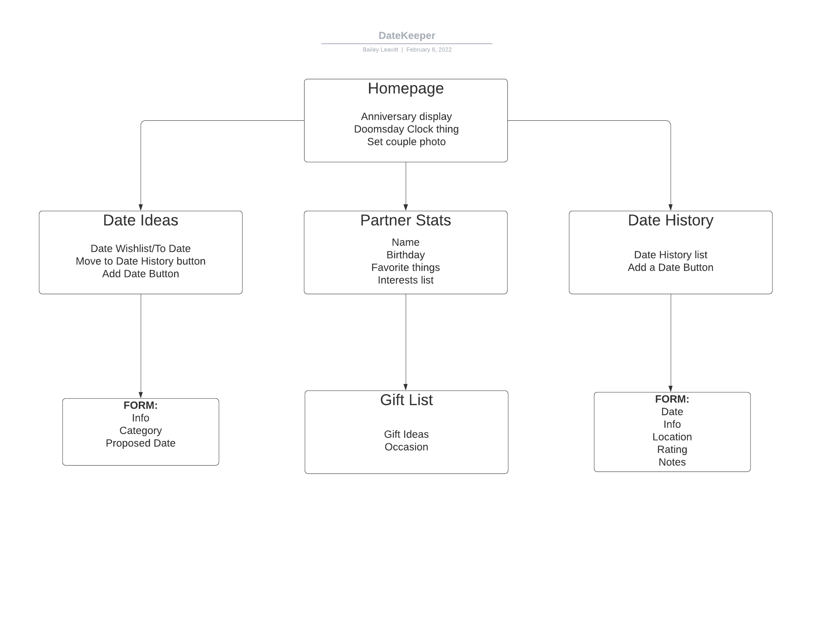

<!--  -->
# Cupid's Quiver
## The Future of Romance
#### Created & Coded By Bailey Leavitt
#### Feb 2022

#### Connect with the Creator
[Bailey's LinkedIn](https://www.linkedin.com/in/baileyleavitt/)

#### Behind the Scenes - Project Management
[Trello Board for Cupid's Quiver](https://trello.com/b/2h2URmmg/datekeeper)

<!-- ### Nerdy Nomad Deployment via Heroku
[Nerdy Nomad](https://nerdy-nomad.herokuapp.com/) -->
***

## Description
With our busy lives, it seems nearly impossible to keep the romance and excitement alive in a relationship--there's just so much information to track! **Cupid's Quiver** is here to help! 

Relationships can be such a wonderful thing, but how do you keep track of dates you want to go on, dates you've been on, and all the beautiful attributes of your partner? What about gift ideas? I can't tell you how many times I've scrambled to find the perfect gift for my partner, and it always feels like I could've put more thought into it once the gift is given. Or the number of times I've come up with some AWESOME date idea that never gets implemented because I keep forgetting about it. 

**Cupid's Quiver** removes all the frustration from this part of your romantic life, and makes it easy for you and your partner to enjoy each other. Let **Cupid's Quiver** be the brains for your heart. <3

***
## Tech Used
React Native | Expo | JavaScript (ES6) | HTML5 | CSS3
***
## App Design

<!-- 

***

## Getting Started
Users can enjoy Nerdy Nomad without ever logging in or creating an account, but all interactive portions of the site are blocked using conditional rendering. Once the user signs up or signs in, they get the full enjoyment of adding science centers to the database, personalizing their profiles, commenting on science centers, and rating science centers! The side nav bar on the site makes navigation across pages easy, and most pages are equipped with back buttons to return the user to the home page (for those who don't want to use the back button in the browser).

***

## App Design

***

## Screenshots from Nerdy Nomad

***

## Frontend Requirements
- [X] Home/Landing page
- [X] Nav bar
- [X] Sign up form
- [X] Login form
- [X] User profile
- [X] Science center posts
- [X] Comments on science center components
- [X] Ratings on science center components
- [X] React Rainbow

## Backend Requirements
- [X] User Authentication
- [X] POST - 'Create' user profile
- [X] POST - 'Create' science center
- [X] POST - 'Create' comment
- [X] POST - 'Create' rating
- [X] GET - 'Read' all science centers
- [X] GET - 'Read' searched science centers
- [X] GET - 'Read' science centers by state
- [X] GET - 'Read' science centers by user id
- [X] GET - 'Read' comments on a science center page
- [X] PUT - 'Update' science center
- [X] PUT - 'Update' user profile
- [X] PUT - 'Update' comment
- [X] DELETE - 'Delete' science center
- [X] DELETE - 'Delete' user profile
- [X] DELETE - 'Delete' comment

***

## Post-MVP Additions
- Implement external API (MapBox) to show users the nearest science center to them
- See Trello Board for full list!

***

## Credits
- `LucidChart`: [CHD & ERD](https://lucid.app/)
- `Canva`: [Graphic Design for Logos, Default Images, and Rating Images](https://www.canva.com/)
- `React Rainbow`: [Mostly for Forms - but NOT Ratings - just for Hunter](https://react-rainbow.io/) -->